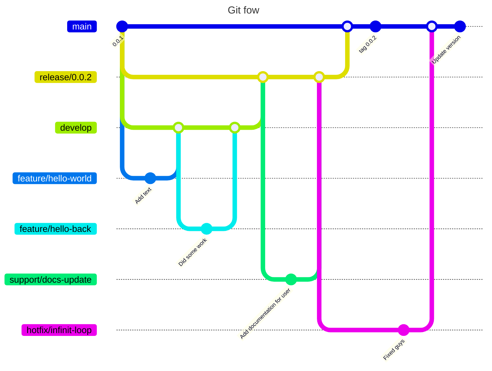

# Meet Astro

## How to start the project

### 1. Clone the repository

```bash
git clone https://github.com/MeetAstroAI/Astro-NEW-.git
```

### 2. Install dependencies

For the dependencies, we use either `npm` or `yarn`. You can choose the one you prefer.

```bash
yarn install
# or
npm install
```

### 3. Set up the environment variables

Create a `.env` file at the root of the project. Either copy the `.env.example` file and rename it to `.env` or create a new file and add the content of the `.env.example` file. If missing, secret keys will be provided by the project manager.

```bash
cp .env.example .env
```

### 4. Start the development server

```bash
yarn dev
# or
npm run dev
```

## How to contribute ?

For git we use the git flow workflow. If you are not familiar with it, you can read more about it [here](https://www.atlassian.com/git/tutorials/comparing-workflows/gitflow-workflow). But we aren't using the command line tool, we are doing it manually. (The command line work well for local development but not for a team of developers, you can use it to create your branch but be updated on the state of the remote at the moment your create your branch).



### 1. Create a feature branch

```bash
git checkout develop
git checkout -b feature/your-feature-name
git push origin --set-upstream feature/your-feature-name
```

To merge your feature branch into the develop branch, you need to create a pull request. The pull request will be reviewed by the project manager or a team member.

If your branch is some commit behind the develop branch, you need to rebase your branch on the develop branch.

```bash
git checkout develop
git pull
git checkout feature/your-feature-name
git rebase develop
```

### 2 Create a release branch

When you are ready to release a new version of the app, you need to create a release branch.

```bash
git checkout develop
git checkout -b release/version-number
git push origin --set-upstream release/version-number
yarn version | --major | --minor
```

No new features should be added to the release branch. Only bug fixes and documentation updates are allowed.

### 3. Create a hotfix branch

If a bug is found in the main branch, you need to create a hotfix branch.

```bash
git checkout main
git checkout -b hotfix/bug-name
git push origin --set-upstream hotfix/bug-name
```

Create your pull request and wait for the review. Once the pull request is approved, you can merge it into the main branch. Don't forget to update the version number in the package.json file.

### 4. Create a support branch

If you need to update the documentation or add some documentation, you need to create a support branch.

```bash
git checkout release/version-number
git checkout -b support/docs-update
git push origin --set-upstream support/docs-update
```

Create your pull request and wait for the review. Once the pull request is approved, you can merge it into the release branch.

## How to update version number

To update the version number, you need to run the following command:

```bash
yarn version | --major | --minor | --patch
# or
npm version | major | minor | patch
```

## Clean your self up

After your branch has been merged if the github merge doesn't delete the branch on the remote you can delete it manually.

```bash
git branch -d branch-name
git push origin --delete branch-name
```

## How the project is structured

The project is structured as follows:

```
.
├── backend (server)
├── frontend (web app client)
├── landing-page (landing-page)
```
